# Dự án Phân tích và Dự đoán AI/Data Job Salary (Global Market)

Đây là một dự án ứng dụng web full-stack có khả năng dự đoán mức lương cho các công việc trong lĩnh vực Trí tuệ Nhân tạo (AI) và Khoa học Dữ liệu dựa trên các thuộc tính khác nhau của công việc. Dự án sử dụng một pipeline Machine Learning được xây dựng bằng Scikit-learn và được phục vụ thông qua một backend API bằng FastAPI.

## 🚀 Demo Trực Tuyến

**Website đang hoạt động tại:** [https://machine-learning-project-qy7k.onrender.com/](https://machine-learning-project-qy7k.onrender.com/)  

## 📊 Dashboard Dự Án
1. **Dashboard 1:**


2. **Dashboard 2:**


3. **Dashboard 3:** Still updating ...

## 📁 Cấu Trúc Dự Án

```
.
├── api.py                  # Logic ứng dụng FastAPI
├── build_pipeline.py       # Script để huấn luyện và lưu pipeline ML
├── Dockerfile              # Hướng dẫn để build Docker container
├── evaluation.py           # Các hàm để đánh giá mô hình
├── feature_engineering.py  # Các transformer tùy chỉnh của scikit-learn
├── frontend/               # Toàn bộ các tệp frontend
│   ├── index.html          # Trang HTML chính
│   ├── script.js           # Logic JavaScript của frontend
│   └── styles.css          # CSS để tạo kiểu dáng
├── requirements.txt        # Các thư viện Python cần thiết
├── salary_prediction_pipeline.joblib # Mô hình ML đã được huấn luyện và lưu lại
└── Data_Analyst.ipynb # Phân tích dữ liệu file csv
└── Dashboard.pbix # Dashboard phân tích
```

## 🌟 Tính Năng Nổi Bật

-   **Dự đoán Thời gian thực**: Nhận ước tính lương ngay lập tức bằng cách điền vào biểu mẫu.
-   **Giao diện Hiện đại**: Một giao diện người dùng sạch sẽ, đáp ứng tốt (responsive), và thân thiện được xây dựng với các nguyên tắc thiết kế hiện đại.
-   **Backend Mạnh mẽ**: Một API hiệu năng cao được xây dựng bằng FastAPI.
-   **Pipeline ML Nâng cao**: Một pipeline Scikit-learn end-to-end tự động xử lý toàn bộ quá trình tiền xử lý dữ liệu và kỹ thuật đặc trưng.
-   **Đóng gói (Containerized)**: Được đóng gói hoàn toàn bằng Docker để dễ dàng triển khai và mở rộng.

## 🏗️ Kiến Trúc Dự Án

Ứng dụng được thiết kế như một dịch vụ độc lập, nơi backend FastAPI phục vụ cả mô hình machine learning và các tệp tĩnh của frontend.

```mermaid
graph TD
    subgraph "Trình duyệt Người dùng"
        A[index.html] -- Gọi API --> B(Backend FastAPI);
    end

    subgraph "Docker Container"
        B -- Phục vụ --> A;
        B -- Sử dụng --> C[salary_prediction_pipeline.joblib];
        C -- Xử lý Dữ liệu --> D[Mô hình XGBoost];
        D -- Trả về Dự đoán --> B;
    end

    B -- Trả về JSON --> A;
```



-   **Frontend**: Một ứng dụng trang đơn (SPA) tĩnh được xây dựng bằng HTML, CSS, và JavaScript thuần. Nó chịu trách nhiệm thu thập thông tin đầu vào từ người dùng và hiển thị kết quả dự đoán.
-   **Backend (API)**: Một ứng dụng FastAPI có nhiệm vụ:
    1.  Phục vụ các tệp của frontend.
    2.  Cung cấp một endpoint `/predict` chấp nhận chi tiết công việc ở định dạng JSON.
    3.  Tải pipeline Machine Learning đã được huấn luyện.
    4.  Thực hiện dự đoán và trả về kết quả.
-   **Pipeline ML**: Một mô hình `XGBRegressor` được gói trong một `scikit-learn.pipeline.Pipeline`. Pipeline này bao gồm tất cả các bước cần thiết:
    -   **Kỹ thuật Đặc trưng (Feature Engineering)**: Các transformer tùy chỉnh để tạo đặc trưng từ ngày tháng và kỹ năng.
    -   **Tiền xử lý (Preprocessing)**: Điền dữ liệu thiếu (với `SimpleImputer` và `KNNImputer`), mã hóa (với `OneHotEncoder`, `OrdinalEncoder`, và `TargetEncoder`), và chuẩn hóa (`StandardScaler`).

## 🛠️ Công Nghệ Sử Dụng

-   **Backend**: Python, FastAPI, Uvicorn
-   **Machine Learning**: Scikit-learn, XGBoost, Pandas, NumPy, Joblib
-   **Frontend**: HTML5, CSS3 (Flexbox, Grid, Animations), JavaScript (ES6+, Fetch API)
-   **Triển khai**: Docker, Render.com

## 🚀 Bắt đầu

Làm theo các hướng dẫn sau để có một bản sao của dự án và chạy nó trên máy cục bộ của bạn.

### Yêu cầu Cần có

-   Python 3.9 trở lên
-   Docker Desktop (tùy chọn)

### Cài đặt & Thiết lập

1.  **Clone repository về máy:**
    ```bash
    git clone https://github.com/thethien8a/AI-Job-Salary-Prediction
    cd AI-Job-Salary-Prediction
    ```

2.  **Cài đặt các thư viện Python:**
    ```bash
    pip install -r requirements.txt
    ```

3.  **Xây dựng Pipeline ML:**
    *(Bước này chỉ cần thiết nếu tệp `.joblib` không tồn tại hoặc nếu bạn muốn huấn luyện lại mô hình.)*
    ```bash
    python build_pipeline.py
    ```
    Lệnh này sẽ tạo ra tệp `salary_prediction_pipeline.joblib`.

### Chạy Ứng Dụng Trên Local

#### Phương pháp 1: Chạy trực tiếp với Python

1.  **Khởi động server API:**
    ```bash
    uvicorn api:app --host 0.0.0.0 --port 8000 --reload
    ```
    
2.  **Truy cập ứng dụng:**
    Mở trình duyệt và truy cập `http://localhost:8000`

3.  **Kiểm tra API:**
    - Health check: `http://localhost:8000/health`
    - API docs: `http://localhost:8000/docs`

#### Phương pháp 2: Sử dụng Docker

Đây là cách được khuyến nghị để chạy toàn bộ ứng dụng như một dịch vụ độc lập.

1.  **Build Docker image:**
    ```bash
    docker build -t salary-predictor .
    ```

2.  **Chạy Docker container:**
    ```bash
    docker run -d -p 8000:8000 --name salary-app salary-predictor
    ```

3.  **Truy cập ứng dụng:**
    Mở trình duyệt và truy cập `http://localhost:8000`
